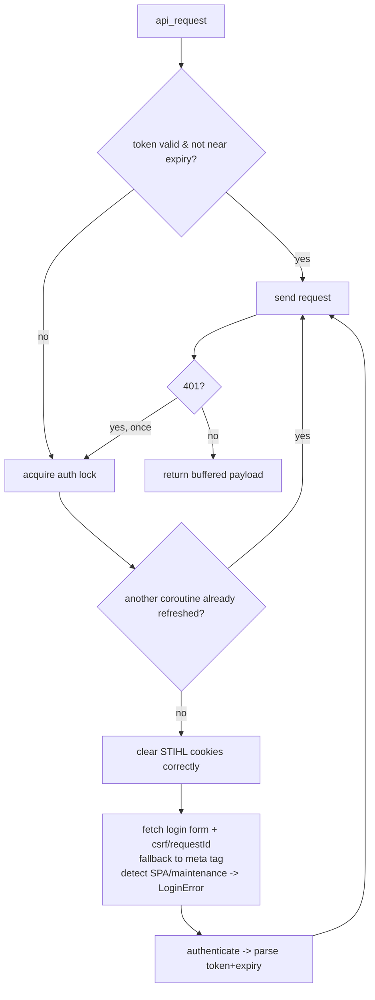

# Review & Update Plan — `imow-webapi`

Unofficial async Python wrapper for the STIHL iMOW cloud WebAPI. This document
captures the findings of an authentication-flow and robustness review, plus a
prioritized plan to make the library stable enough that the Home Assistant
integration no longer needs a restart to recover from login failures.

> Scope agreed: open to breaking changes with a version bump; open to reworking
> the auth flow if it is meaningfully more reliable. Integration tests can be run
> against a repo-root `secrets.py`.

---

## TL;DR — Root cause of the reported crash

Observed traceback (HA config flow):

```
File ".../imow/api/__init__.py", line 237, in __fetch_new_csrf_token_and_request_id
    ).get("value")
AttributeError: 'NoneType' object has no attribute 'get'
...
ProcessLookupError: Did not find necessary csrf token and/or request id in html source
```

**Cause:** the GET to `oauth2.imow.stihl.com/authentication/?...` did not return the
login form, so `soup.find("input", {"name": "csrf-token"})` returned `None`.

This happens when the shared `aiohttp` session already holds valid STIHL auth
cookies: the authentication endpoint then redirects to the already-logged-in
Angular SPA shell (`<stihl-imow-root>`, no form inputs) instead of the login form.

**Confirming evidence:**
- The saved `login.html` contains `<input name="csrf-token">` and
  `<input name="requestId">` — what the scraper expects.
- The saved `logged-in.html` is the SPA shell with none of those inputs.
- "Restarting Home Assistant once fixes it" — a restart discards the shared
  session + cookie jar, so the next login lands on the real form. This maps
  directly to a cookie-isolation problem.

Why cookies survive across attempts even with `force_reauth=True`:
`api_logout()` tries to clear cookies with `cookie_jar.clear_domain("https://app.imow.stihl.com")`,
but `clear_domain()` expects a **host** (`app.imow.stihl.com`), not a URL — so it
clears nothing.

---

## Findings by severity

### 1. Cookie isolation — CRITICAL (the actual bug)
- **Where:** `__fetch_new_csrf_token_and_request_id`, `api_request`, plus HA passing
  `async_get_clientsession(hass)` (a long-lived shared jar).
- **Problem:** auth cookies leak between calls and across the rest of HA. Once a
  login has seeded cookies, the next `force_reauth` lands on the SPA shell.
- **Recommendation:** give `IMowApi` its **own** cookie jar for the OAuth
  handshake (don't share HA's global jar), and/or explicitly + correctly clear
  STIHL cookies before every fresh authentication. Isolation is the more robust
  default; keep a shared connector only for connection reuse if needed.

### 2. Broken logout cookie clearing — HIGH
- **Where:** `api_logout()`.
- **Problem:** `clear_domain("https://app.imow.stihl.com")` / `clear_domain("https://oauth2.imow.stihl.com/")`
  pass URLs instead of hosts, so nothing is cleared. Also POSTs logout even when
  `csrf_token` is empty.
- **Fix:** `cookie_jar.clear_domain("app.imow.stihl.com")` and
  `clear_domain("oauth2.imow.stihl.com")`; guard against empty `csrf_token`.

### 3. Fragile CSRF scraping + misleading exception — HIGH
- **Where:** `__fetch_new_csrf_token_and_request_id`.
- **Problem:** assumes the hidden inputs exist; any miss raises a misleading
  `ProcessLookupError` with a bare `NoneType` root cause.
- **Fix:**
  - Fall back to the `<meta name="csrf-token">` tag when the hidden input is absent.
  - Detect the logged-in SPA shell (`<stihl-imow-root>`) and the maintenance page,
    and raise a clear, typed `LoginError` instead.
  - Include a short redacted diagnostic (HTTP status + `response.real_url`) so
    failures are debuggable.

### 4. No lock around (re)authentication — HIGH
- **Where:** `get_token` / `__authenticate`.
- **Problem:** nothing serializes re-auth. Under concurrent HA polling + a service
  call, multiple coroutines can enter auth simultaneously, racing on
  `self.csrf_token` / `self.access_token` and firing parallel logins.
- **Fix:** wrap auth in an `asyncio.Lock` with double-checked validation so only
  one coroutine actually re-authenticates.

### 5. Token-expiry refresh skipped for injected tokens — HIGH
- **Where:** `api_request` proactive refresh is gated on `if self.token_expires and ...`.
- **Problem:** when a token is supplied via the constructor without an expiry,
  `token_expires` is `None`, so it never proactively refreshes; failure only
  surfaces as a 401.
- **Fix:** persist/restore `token_expires` with the token; treat "unknown expiry"
  as "validate before use"; add a 401 → re-auth-once-and-retry path.

### 6. `api_request` returns a released response — MEDIUM
- **Where:** `api_request` uses `async with self.http_session.request(...) as response:`
  then `return response`.
- **Problem:** the response context is closed on exit; callers then call
  `await response.text()`. It only works because `await response.read()` buffers
  the body first — brittle.
- **Fix:** return the already-read payload (bytes/text/parsed JSON) from within the
  context, or `read()` and return without an `async with`. Standardize callers.

### 7. No retry/backoff on transient failures — MEDIUM
- **Where:** `api_request` (500 → maintenance check → re-raise), all GETs.
- **Fix:** bounded retries with exponential backoff + jitter for idempotent GETs
  and the auth handshake; keep non-idempotent POSTs (intents) single-shot or
  opt-in.

### 8. Truncated OAuth `state` parameter — LOW (but risky)
- **Where:** redirect URL in `__fetch_new_csrf_token_and_request_id` ends with
  `...%26state` (empty value).
- **Fix:** generate a random `state`, include it, and ideally verify it on return
  (CSRF protection for the redirect).

### 9. Extra full mower fetch on every auth — LOW
- **Where:** `get_token` → `validate_token` → `receive_mowers()`.
- **Fix:** validate with a lightweight call, or skip validation immediately after a
  successful authenticate (the token is known-fresh).

### 10. Minor safety / hygiene — LOW
- `close()` calls `self.http_session.close()` without a `None`/closed guard; also
  don't close a session the caller owns (HA's shared session).
- Naive `datetime.now()` used for expiry math — prefer timezone-aware UTC to avoid
  DST edge cases.
- `__authenticate` hand-builds the form body (trailing space after `requestId=`);
  prefer `aiohttp` form encoding (`data={...}`).
- Never log tokens/credentials (already mostly redacted — keep it that way).

---

## Login-flow analysis (what this actually is)

### Flow type: OAuth 2.0 Implicit Grant
The saved login URL is explicit about the flow:

```
.../authorization/?response_type=token
   &client_id=9526273B-1477-47C6-801C-4356F58EF883
   &redirect_uri=https://app.imow.stihl.com/#/authorize
   &state=U9P5vaGwx6z1hUFXzxkpsbJ0tJCwOQisuNKUluYs
```

- `response_type=token` → the authorization server returns the token **directly
  in the redirect URL fragment** (`#access_token=...&expires_in=...`). That is the
  defining trait of the implicit grant, and is exactly what `__authenticate` reads
  via `furl(response.real_url).fragment.args`.
- **No `code` exchange, no `/token` endpoint, no refresh token.** The wrapper
  therefore holds a long-lived (~30 day) `access_token` and re-scrapes the HTML
  login form to mint a new one.
- The `csrf-token` is a short-lived **HS256 JWT**. Decoding the sample from
  `login.html`: header `{"typ":"JWT","alg":"HS256"}`, and `exp - iat = 172800s`
  (**48h**). So `csrf-token` + `requestId` cannot be cached — they must be scraped
  fresh per login.

> Note: implicit grant is **deprecated** by the OAuth 2.0 Security BCP and removed
> in OAuth 2.1 (replacement: Authorization Code + PKCE). But STIHL's server only
> offers `response_type=token` here, so as a client we are constrained to it.

### Backend framework
- The login page at `oauth2.imow.stihl.com/authentication/` is a **server-rendered
  HTML page** (jQuery + Bootstrap, "viking"-branded theme) — a custom OAuth2
  **authorization server**, distinct from the Angular SPA at `app.imow.stihl.com`
  (the resource client / SPA shell that lacks the form inputs).
- Hosting is **Microsoft Azure App Service**: sibling endpoints in the same pages
  are `*.azurewebsites.net` (`app-api-contract-r-euwe-411542.azurewebsites.net`,
  maintenance host `app-api-maintenance-r-euwe-4bf2d8.azurewebsites.net`).
- **Confirmed from real traffic** (via the added header diagnostic): the login
  page is served by **nginx 1.28.0** with **PHP 8.3.29**
  (`X-Powered-By: PHP/8.3.29`, `Content-Type: text/html`). So the authorization
  server is a **PHP app behind nginx**.
- The header diagnostic remains in `__fetch_new_csrf_token_and_request_id` (logs
  `Server`, `X-Powered-By`, `Content-Type` at DEBUG) to catch upstream changes and
  to surface when we land on an unexpected page:
  - `Server: Microsoft-IIS` + `X-Powered-By: ASP.NET` → .NET
  - `X-Powered-By: Express` → Node.js
  - `X-Powered-By: PHP/...` / `Set-Cookie: PHPSESSID` → PHP ✅ (this one)

### Are there libraries for this? (best practice)
**No drop-in OAuth library fits cleanly** — this is a bespoke *HTML-form + CSRF +
implicit-fragment* flow driven by username/password, not a standards-compliant
token endpoint.

- `authlib`, `oauthlib`, `requests-oauthlib`, `httpx-oauth` expect an Authorization
  Code exchange or a Resource Owner Password grant against a JSON `/token`
  endpoint. STIHL exposes neither, so these only help with the *redirect / state /
  fragment* mechanics, not the credential POST.
- HA's built-in OAuth2 helper (`config_entry_oauth2_flow.AbstractOAuth2FlowHandler`
  + Application Credentials) assumes Authorization Code + refresh-token rotation.
  Implicit + password-form has no refresh token, so it does not apply.

Pragmatic best practice: **keep a purpose-built client, but harden it** (this
review). Where libraries genuinely help:

1. **HTML parsing** — use the `lxml` parser (`BeautifulSoup(html, "lxml")`) for
   resilience, or `selectolax` to drop the heavier dep; plus the `<meta
   name="csrf-token">` fallback and SPA/maintenance detection (items 2–3).
2. **Redirect/state/fragment bookkeeping** — optionally use `authlib`'s
   `AsyncOAuth2Client` to build the authorize URL, generate/verify a real `state`,
   and parse the returned fragment (replaces hand-built URL strings, item 8). The
   credential POST stays custom.
3. **Retries** — `tenacity` (or `aiohttp-retry`) for items 4 & 7 instead of
   hand-rolling backoff.
4. **Session/cookie handling** — stick with `aiohttp`, but give `IMowApi` its own
   `CookieJar` (item 1) so implicit-flow cookies don't leak into HA's shared
   session.

### Recommendation
- Treat this as a **custom implicit-grant password flow** and harden it; do not
  force-fit a generic OAuth library.
- Use `authlib` only for authorize-URL / `state` / fragment parsing; `tenacity`
  for retries; `lxml` for parsing.
- Longer term, the correct fix is upstream: ask STIHL to support **Authorization
  Code + PKCE** with a refresh token. That would remove the HTML scraping entirely
  and allow HA's native OAuth2 support. Until then, the scraped flow is unavoidable.

---

## Target design (robust flow)



Principles: isolated cookie jar, single-flight re-auth via a lock, typed and
diagnostic-rich `LoginError`, buffered responses, bounded retries, persisted
expiry.

---

## How this library fits the HA integration

The wrapper and the Home Assistant integration must agree on **who owns the HTTP
session and its cookie jar**. Home Assistant's own guidance resolves the earlier
open question:

- HA best practice (websession injection, Platinum-tier) is to **inject** a
  web session into the library rather than have the library create its own.
- For a **cookie-based** client like this one, HA explicitly recommends
  `homeassistant.helpers.aiohttp_client.async_create_clientsession(hass)` — which
  creates a session with its **own dedicated cookie jar** — instead of the shared
  `async_get_clientsession(hass)`.

So the aligned contract is:

1. **HA side:** build the client with a dedicated, cookie-isolated session:
   `IMowApi(aiohttp_session=async_create_clientsession(hass), ...)`. This gives
   both connection reuse *and* cookie isolation, and is the HA-side half of
   finding #1.
2. **Wrapper side:** keep accepting an injected `aiohttp_session` (don't force an
   internal one), but:
   - **never close a session it does not own** (finding #10) — the caller owns it;
   - still **defensively clear STIHL cookies before each fresh auth** (finding #2)
     so the library is safe even if a caller passes a shared jar;
   - if no session is injected, create an internal one **with its own cookie jar**.

This makes the two reviews cohere: the wrapper is a well-behaved injectable
library, and the integration injects a correctly-scoped session. The result
eliminates the cookie-leak class of failure without either side depending on the
other's internal details.

---

## Prioritized work plan

| # | Item | Severity | Notes |
|---|------|----------|-------|
| 1 | Isolate cookies + fix `clear_domain` | Critical | Fixes the reported crash |
| 2 | Harden CSRF scraping (meta fallback, SPA/maintenance detection, typed `LoginError`) | High | Graceful degrade |
| 3 | `asyncio.Lock` around auth + double-checked validation | High | Concurrency safety |
| 4 | Handle `token_expires is None` + 401 → re-auth-once-and-retry | High | Correct refresh |
| 5 | Fix `api_request` response handling (return buffered data) | Medium | Robustness |
| 6 | Retry/backoff for GETs and the login handshake | Medium | Transient errors |
| 7 | Generate a real OAuth `state`; tidy `close()` / datetime | Low | Hygiene |

---

## Validation

- Unit tests (offline, fake token): `pytest -s tests/test_unit*`.
- Integration tests (live API; needs repo-root `secrets.py` with `EMAIL`,
  `PASSWORD`, `MOWER_NAME`): `pytest -s tests/test_integration*`.
- Format with `black`; lint with `flake8` before committing.
- Bump `__version__` in `imow/common/package_descriptions.py` for a release, and
  keep the HA integration's `manifest.json` pin (`imow-webapi==x.y.z`) in sync.

---

## Open questions

- ~~Prefer fully isolated session/cookie jar inside `IMowApi`, or keep the
  externally-provided session?~~ **Resolved** (see "How this library fits the HA
  integration"): keep the injected-session contract, but the caller injects a
  cookie-isolated session (`async_create_clientsession` on the HA side), and the
  wrapper defends by clearing STIHL cookies before auth and never closing a
  session it doesn't own.
- Are breaking public-API changes acceptable in this release, or should the first
  release be internal-only fixes (items 1–4) with a minor version bump?
